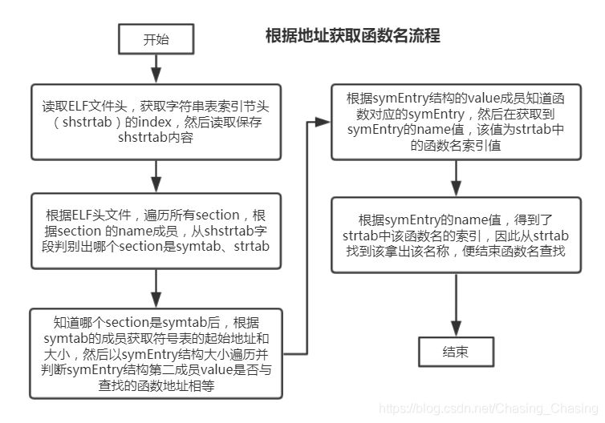

# vim
## how much vim filetypes
    1. echo $VIMRUNTIME
        print "/usr/share/vim/vim81/"
    2. ls $VIMRUNTIME/ftplugin/*
## specify the filetype in file
    add this line /* vim: set filetype=markdown : */
## align plugin Tabular.vim
    align with ':'
        :Tabularize /:
## Ctrl-v选至行尾
    Ctrl-v ... Shift-$
## search highlight 临时取消
    :noh/:nohlsearch
        临时取消，下次搜索时会自动打开
    :set hlsearch
        永久取消
## change file line ending
    :set fileformat=unix
    :dos2unix(need install this tool)
## regular expression
### 替换转大小写方法
    比如有下面这段文字：
    every day
    将两个单词都转变为全大写
    :s/\(.*\) \(.*\)/\U\1 \2/

    转变结果为：
    EVERY DAY

    将上面的文字转变为EVERY day
    :s/\(.*\) \(.*\)/\U\1\e \2/
    上面的四个转义序列将在其被显式停止前，对跟在其后的内容持续作用；如果要停止，需要使用'\e'来中断。
    注:
    \u （将分组第一个字母转换成大写）
    \U （将整个分组转换成大写）
    \l （将分组第一个转换成小写）
    \L （将整个分组转换成小写）
## 结构体成员补全
    1. bash:tag
    2. vim: Ctrl-X Ctrl-O
    vim自带的omni-complete plugin可以利用tags文件找到结构体成员并补全
## 为自定义拓展名文件增加类型识别
    au! BufNewFile,BufRead *.cu,*.cuh setf cpp
    au! BufNewFile,BufRead *.lds setf ld
    au BufNewFile,BufRead *.cu,*.cuh setf cpp
    au BufNewFile,BufRead *.lds setf ld
    :autocmd! 可以删除所有自动命令,此操作也将删除插件所定义的自动命令
    如果我们针对同样的文件和同样的事件定义了多条自动命令，那么当满足触发条件时将分别执行多条自动命令。
    因此，建议在自动命令组的开头增加:autocmd!命令，以确保没有重复的自动命令存在。

# toolchain
## hex file formats
    ihex
        objcopy -O ihex xxx.bin xxx.ihex
    srec(s-recored)
        objcopy -O srec xxx.bin xxx.srec
## link script
    info ld: 比"man"的信息全
### sections
        SECTION [ADDRESS] [(TYPE)] :
          [AT(LMA)]
          [ALIGN(SECTION_ALIGN) | ALIGN_WITH_INPUT]
          [SUBALIGN(SUBSECTION_ALIGN)]
          [CONSTRAINT]
          {
            OUTPUT-SECTION-COMMAND
            OUTPUT-SECTION-COMMAND
            ...
          } [>REGION] [AT>LMA_REGION] [:PHDR :PHDR ...] [=FILLEXP] [,]
    1. bss
        bss: block started by symbol
        存放程序中未初始化的全局变量的一块内存区域
        在初始化时bss 段部分将会清零。bss段属于静态内存分配，即程序一开始就将其清零了
        bss段不在可执行文件中，由系统初始化
    2. text
        存放程序执行代码的一块内存区域
        大小在程序运行前就已经确定
        通常属于只读
    3. data
        存放程序中已初始化的全局变量的一块内存区域
        数据段属于静态内存分配
    4. 一个程序本质上都是由 bss段、data段、text段三个组成的
        text和data段都在可执行文件中（在嵌入式系统里一般是固化在镜像文件中），由系统从可执行文件中加载
    5. '.' location counter
        . = 0x2f000000
        __start = .
### LMA,VMA
        SECTION [ADDRESS] [(TYPE)] :
          [AT(LMA)]
          [ALIGN(SECTION_ALIGN) | ALIGN_WITH_INPUT]
          [SUBALIGN(SUBSECTION_ALIGN)]
          [CONSTRAINT]
          {
            OUTPUT-SECTION-COMMAND
            OUTPUT-SECTION-COMMAND
            ...
          } [>REGION] [AT>LMA_REGION] [:PHDR :PHDR ...] [=FILLEXP] [,]
    VMA是指令执行时所使用的地址,
    LMA是烧录地址,在链接脚本中使用AT来指定
    LMA,VMA大多数情况下是相等的,当它俩不相等时,就要重定位了,
    比如lds中将一个数据段的LMA=0x200,VMA=0x800,此时有一条指令I访问该数据段中的变量时，使用的是VMA(0x800),
    但是，当把该程序烧录到ram中时，该数据段的地址为0x200,所以执行指令I时就会出错，所以就要自己写代码将该数据端
    搬到VMA(0x800)处.
    实例：
    flash的地址空间:0x200-0x10000
    ram的地址空间:0x100000-0x200000
    当希望将数据和代码都烧录到flash中，在运行时，代码放在flash中执行，数据搬到ram中使用，此时就可将数据段的LMA,VMA设成不一样的,来达到这个目的
        .text 0x200 : AT(0x200) {
        *(.text)
        }
        .data 0x100000: AT(0x100000) {
        *(.data)
        }
    上面的lds会导致，生成elf中.text与.data中有一大段0填充，导致elf文件太大，超出flash的size
    可以改称下面
        .text 0x200 : AT(0x200) {
        *(.text)
        }
        .data 0x100000: AT(ADDR(.text) + SIZEOF(.text)) {
        *(.data)
        }
    这样之后，.data就会紧跟.text段，中间不会填0，size就会变小，就可以烧录到flash中
## gcc
    arm-none-eabi-gcc -v --help
    display all sub options
    1. -Wp,option
    2. -Wa,option
    3. -Wl,option
    4. -nostdlib
    5. --specs=nosys.specs(/usr/lib/arm-none-eabi/lib/nosys.specs)
    6. -e entry
       --entry=entry
## ld
    1. -Ttext=0x02000100
    2. -Ttext-segment=
    3. -e__start
## 重定位
## specs file
    Spec 文件(Spec files) 就是用来配置 SPEC 字符串的
    gcc is gnu compiler collection
    specs is control the compiler component:cpp,cc1,asm,linker...
    when you use gcc's component single, the specs don't take effect. eg: "gcc -o" just invoke cpp,cc1,asm. don't invoke linker
## spec string(specs)
## info ld
## info gcc

# arm instruction set
    bfi
        Bitfield Insert copies a bitfield of <width> bits from the least significant bits of the source register
        to bit position <lsb> of the destinationregister, leaving the other destination bits unchanged
        BFI <Wd>, <Wn>, #<lsb>, #<width>
    当操作结构体位域时，会自动生成bfi类似指令，该指令效率很高，建议以后驱动中使用结构体位域格式化寄存器.
    注意:为避免出错，如果是32位架构，结构体中所有成员使用unsigned int型
        typedef union {
        struct {
        uint32_t startBitMidpoint:      16;
        uint32_t baudCompensateValue:   4;
        uint32_t reserved31To20:        12;
        } reg;
        uint32_t all;
        } SGR5UartComps_t;

# info and man
    info 来自自由软件基金会的 GNU 项目，是 GNU 的超文本帮助系统，能够更完整的显示出 GNU 信息。所以得到的信息当然更多
    man 和 info 就像两个集合，它们有一个交集部分，但与 man 相比，info 工具可显示更完整的　GNU　工具信息。若 man 页包
    含的某个工具的概要信息在 info 中也有介绍，那么 man 页中会有“请参考 info 页更详细内容”的字样。

# VMA与LMA不一致
    发现stream中link.ld指定了data section的LMA，编译后，用arm-none-eabi-objdump -h stream读出来的data section的VMA与LMA不一致，
    运行时，去找data段中的数据，是按照VMA找的，Ozone加载data section时是按照LMA加载的,所以找data段里的数据会找错位置.
    如果VMA与LMA不一致，除非，自己将data section的数据搬到VMA指定的ram位置，而非LMA指定的ram位置，否则就必须让它俩一致

# OpenMP
    1. OpenMP的指令
    2. 只能用于for循环
    3. 循环中的数据没有依赖
    4. 有专门的库支持

# centos default shell
    1. exec bash //在csh中执行bash，将其替换
    2. usermod改变用户的默认shell，创建用户时，也可指定默认shell //需要root权限

# object-oriented programming
    1. 编写qspi test case中：对controller的属性的抽象要细化，分类抽象，比如DAC INDAC STIG 要分开抽象，
       对属性抽象的好坏决定方法实现的是否方便，决定方法能否有很高复用性
    2. 思考对象有哪些行为（方法）
    3. 每一种方法的多样化因素
    4. 思考对象有那些属性，包括上一条中的因素

# printk根据函数地址打印函数名
    %p：打印裸指针(raw pointer)
    %pF可打印函数指针的函数名和偏移地址
    %pf只打印函数指针的函数名，不打印偏移地址。
    %pM打印冒号分隔的MAC地址
    %pm打印MAC地址的16进制无分隔
    %I4打印无前导0的IPv4地址，%i4打印冒号分隔的IPv4地址
    %I6打印无前导0的IPv6地址，%i6打印冒号分隔的IPv6地址
总结:

# Fourier transformation
## application
    将原信号变换一下，变换后的信号在不同频率段做不同处理，例如某个频率段完全过滤掉，再变换回原信号）。
    对应声音来说，可能就是某个低频段的噪音被去掉了，原声音会更清楚。对于图像来说，看各个答主举得例子更直白。
    1. 声音降噪
    利用傅里叶，将信号拆分成多个频段的波形组，然后滤掉噪声频率段的波形
    2. 图像磨皮
    去除图像中的噪点
    3. 信号传输多载
    将多路不同频率的信号，利用傅里叶原理叠加在一起，传输出去，接收端再拆分出来
        一种是10-90上升时间，指信号从终值的10%跳变到90%所经历的时间。
        第二种定义方式是20-80上升时间，这是指从终值的20%跳变到80%所经历的时间
        下降时间通常要比上升时间短一些，这是由典型CMOS输出驱动器的设计造成的。
## 频域
    频域最重要的性质是：它不是真实的，而是一个数学构造。时域是惟一客观存在的域，而频域是一个遵循特定规则的数学范畴。

# linux统一账户认证方案
## PAM
    [service] module-type control-flag module-path [arguments]
    PAM 配置文件中的字段包括：
        service： 指定服务/应用程序的名称，如 telnet、login、ftp 等（默认值为 OTHER）。
        module-type： 为 service 字段中的服务/应用程序指定模块类型，模块类型有四种类型（auth/account/session/password）。
        control-flag： 指定了"配置段"里的模块应该怎么相互作用，可以理解为对 PAM 认证的流程控制，它可以获取诸如 requisite、required、sufficient 和 optional 之类的值。
        module-path： 指定实现模块的库对象的路径名称。最好使用绝对路径，缺省路径一般是/lib/security 或/lib64/security。
        arguments：指定可以传递给服务模块的选项或参数（可选字段）。
## /proc/key-users
## sssd(System Security Services Dameon)
    sssd是一款用以取代ldap和AD的软件，配置比较简单。
    id zhuwch@sic.com #从AD中获取域用户信息
    本文介绍如何在ldap客户端部署sssd，来启用ldap认证。
## ssl
    SSL(Secure Sockets Layer 安全套接字协议),及其继任者传输层安全（Transport Layer Security，TLS）是为网络通信提供安全及数据完整性的一种安全协议。TLS与SSL在传输层与应用层之间对网络连接进行加密。
## nss
## ldap(Light weight Directory Access Protocol)
    轻量级目录访问协议
    其前身是更为古老的DAP协议
    client<--->ldap<--->db
    LDAP Client指各种需要身份认证的软件，例如Apache、Proftpd和Samba等。LDAP Sever指的是实现LDAP协议的软件，
    例如OpenLDAP等。Datastorage指的是OpenLDAP的数据存储，如关系型数据库（MySQL）或查询效率更高的嵌入式数据库（BerkeleyDB），
    甚至是平面文本数据库（—个txt的文本文件）。可见，OpenLDAP软件只是LDAP协议的一种实现形式，并不包括后台数据库存储。
    但在很多时候管理员经常将LDAP Server和DataStorage放在同一台服务器，这样就产生了人们通常所说的“LDAP数据库”。
    虽然后台数据库（backend）可以是多种多样，但LDAP协议还规定了数据的存储方式。LDAP数据库是树状结构的，与DNS类似，
### openldap
    是LDAP协议的实现，是一款开源应用
## 单点登录（Single Sign On）
    简称为 SSO，是比较流行的企业业务整合的解决方案之一。SSO的定义是在多个应用系统中，用户只需要登录一次就可以访问所有相互信任的应用系统。
## AD(active directory)
    目录是一类为了浏览和搜索数据而设计的特殊的数据库。例如，为人所熟知的微软公司的活动目录（active directory)就是目录数据库的一种。
    目录服务是按照树状形式存储信息的，目录包含基于属性的描述性信息，并且支持高级的过滤功能。

# cpu/mem/disk info display
    | cat /proc/cpuinfo   | top                  |
    | cat /proc/meminfo   | free -lh             |
    | cat /proc/diskstats | cat /proc/partitions | df -lh |

# hardware design
    DFT: design for test
    DUT: design under test
    TB: test bench
    simulation: software, 传统的仿真
    emulation: hardware，可视为Simulator的补充（不是替代），软件仿真的硬件化，极大提高了仿真效率
    verification
    Cadence: Palladium
    Synopsys: ZeBu
    Mentor: veloce
    EDA: Electronic Design Automation
    CDA
    CAD: Computer Aided Design
    HDL: hardware discriptor luanguage
    RTL: Register Transfer Level
    ICE: In-Circuit Emulator(电路内仿真)
    DPI: direct program interface
    PLI/VPI: program language interface/ verilog program interface
## veloce emulation flow
       tools                           process files
    1. vellib                      --> create libraties
    2. velmap                      --> map libraries
    3. create a veloce.config file
    4. velanalyze                  --> analyze RTL files
    5. velcomp                     --> compile DUT files
    6. velhvl or vlog              --> compile testbench files
    7. velrun or vsim              --> Run Emulation
    8. velview                     --> debug
## linux HDL toolchains
    1. iverilog
        compile
         iverilog xx.v -->a.out
        run
         ./a.out-->a.vcd (实际是vpp解析a.out,生成vcd文件)
        display wave
         gtkwave a.vcd
    2. ghdl
        compile
         ghdl -a xx.vhd
         ghdl -e xx
        run
         ghdl -r xx --vcd=xx.vcd
        display wave
         gtkwave xx.vcd
    3. gtkwave
## 仿真器基本架构原理(前仿)
    Verilog语言确实不是一种可执行语言 。 图2展示了利用Verilog源文件进行仿真的过程 。 绝大
    多数仿真器都遵循这一思路 , 比如VCS 、 iVerilog 、 ModelSim 、 Vivado和Quartus等 。 首先 ,
    准备Verilog源文件以及一些Verilog库文件(标准单元等) 。 仿真器接收这些Verilog文件并将
    其转化为可执行的仿真源文件(C/C++等) 。 在这一过程中 , 仿真器解析Verilog文件的语法
    结构 , 并且根据Verilog语法的规范 , 将语法结构转化为仿真器中的事件响应函数或代码段 。
    这些函数和代码段与仿真器框架源文件一起成为可执行仿真程序的源文件 。 接下类这些源文
    件经过编译得到可执行的仿真程序 。 VCS和iVerilog可以看到生成的可执行文件 。 ModelSim 、
    Vivado和Quartus使用GUI管理设计流程 , 从而将这个可执行文件屏蔽了 , 使其对于用戶可
    透明 。 用戶可以在工程中找到生成的可执行文件 。 最后 , 运行可执行的仿真程序 , 进行软件 仿真 。

    仿真程序通常采用基于事件的仿真架构,这些事件响应函数模拟硬件电路的行为 ，并且产生了新的事件
    通过“读出第一个事件-响应事件-插入新事件”的循环 ， 事件队列可以一直运行下去 ， 直到事件队列为空或者达到了仿真结束的时间
    在仿真开始的时候 ， 必须向事件队列中插入起始事件 ， 从而开始仿真循环
## vim verilog plugin
## RTL生成原理图(后仿)
    Vivado可以查看综合或者布局布线后的原理图
    也可以在完成 RTL 编码后查看 RTL 分析 （RTL ANALYSIS） 的原理图
    在综合后的原理图中电路已经被映射到器件的 LUT 和 FF 中，并且经过了综合器的优化。相比原先的代码,可以说"面目全非”了。
    而 RTL 分析的原理图用逻辑门，选择器以及触发器来表示电路，并尽量使用代码中的变量名表示，可以更清晰地和代码对应
    这样一来，就知道自己的代码会变成怎样的电路器件，与门，非门，选择器，加法器等等。尽管我保证他们哪个在 FPGA 上都不存在。
    不过，我们可以将他们映射到 LUT 上实现—— 一种 FPGA 上有的是的东西。
    举个例子
    一个计数器的电路就跃然纸上了，其实计数器和 CPU 都是一样的（真的）。
    右键某个元件，在菜单中选择 Go to Source, 可以跳转到你代码中的相应部分。
        Tool>>Netlist Viewers>>RTL Viewers
        Quartus生成原理图在我们的工程创建完毕后，即vhd代码编写并保存完毕后，通过File→Create/Update→Create Symbol Files for Current File即可生成原理图。生成成功的话会提示：生成成功后，在工程的目录下，我们可以找到 实体名.bsf 文件
    1. RTL视图
       编译通过后
       Tools --> Netlist Viewers ----> RTL Viewer
    2. 框图的生成为:
       File -- >Create/Update ---> Create Symbol Files for Current file

##verilog
### 位拼接
### sv中CpuRead/CpuWrite实现
    svExecuteMan("cpu", "cpu_cmd", pktload, pktloads, NULL);
    task execute_man (....);自己实现一个task，在这个task中完成
    最终，通过调用例化的axi或mem实例来完成
### display与io_printf区别
    display用在module中
    io_printf用在task/func/program中?只能在sv中用?
    you can use the io_printf function to get some diagnostics from your C code on to the simulator console
### R5跑的程序怎么和sv-vip通信
    R5访问的sram是通过sv例化的，在这个例化的sram中，找一块空间,当共享内存来与sv通信。
    sv中可以直接调用sram实例

## vcs,verdi
### vcs
### verdi
    1. verdi的instance对话框中有俩列：
        左边一列(Hierarchy): 是实例的层级结构图，在添加波形时，只能在实例中找到变量，然后ctrl-w，才可以添加
        右边一列(Module):   是左边实例对应的类型名，在类型中是不能添加波形的，因为它没有实例化
